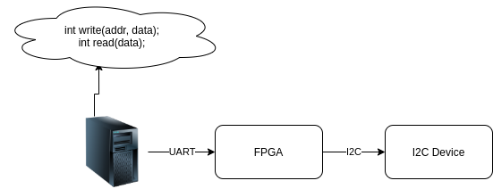

# CodingTest

An Engineer working in core electronics is expected to be familar with 

1. Writing, testing and debugging 
    1.1 Firmware
    1.2 RTL Code
    1.3 Testcases
2. Commiting code to Version control system.

In most cases the academic coursework teaches less than 10% of these skills, Self learning is an important aspect in a Research and Design oriented Job Role.

If you can complete the steps listed below, We will be interested in discussing a career at Dyumnin Semiconductors with you.

# Dyumnin Semiconductors, Take home Design and verification coding test for new college graduates.

Take home coding test.

* This test mimic's the workflow for an NCG at Dyumnin Semiconductors.
* There is a high probability that your first assignment at work will be on similar lines to the steps listed below.
* There are some aspects of tools and techniques which may not be a part of your regular engineering course work, tutorials for most are available online. While some may require research on your part.

**Assumption** 
1. The candidate know's verilog/VHDL, Algorithms, Verification(UVM,VUnit,CocoTB etc.), Digital logic and has worked with FPGA's

**Problem Statement**

1. A system is being built which, on one end communicates with a server via UART, and on the other is connected to an I2C based peripheral.
2. The Server API defines two functions `write(unsigned address,unsigned data);` and `unsigned read(unsigned address);` which will be used to access different address spaces in the I2C peripheral.
3. Use any FPGA that you are comfortable with to build and test this system.

# Instructions:

## Step 1:

1. Fork/Clone this repository.
2. Create a branch with "candidate/{your name} as the branch name.
3. Write the RTL code for the FPGA and implement the server API to communicate with the FPGA

Checkin the files and tag it as Step 1

## Step 2:

Create a testplan and testcase list for this design.
Checkin the testplan and tag it as Step2
**Ref:** https://verificationacademy.com/cookbook/coverage 

## Step 3:

Implement the verification env and verify atleast 2 test
You can implement the verification code in either Verilog/VHDL/SystemVerilog or Python (We use cocotb internally for all our verification).

**Ref:** https://cocotb.readthedocs.io/

## Step 4.

Create a pull request on the original repo with your code submission.

Once the pull request is created we will schedule the next round of interview.

In case of any issues, raise an issue in the github issue tracking system for this repo..
